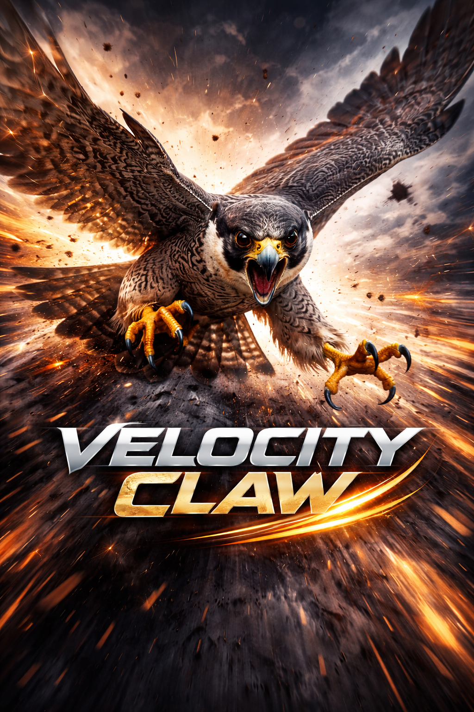

# Velocity Claw

<div align="center">
  
</div>

Velocity Claw — self-hosted AI dev-agent с модульной архитектурой для безопасного выполнения задач, работы с кодом, patch-редактирования, тестового цикла и сохранения execution trace.

Проект находится в состоянии **advanced MVP / strong foundation+**: ключевое ядро уже работает, тесты зелёные, часть product/runtime слоёв реализована, а часть более тяжёлых возможностей ещё остаётся для следующего этапа зрелости.

---

## Что уже реально реализовано

### Ядро агента
- `core/agent.py` — orchestration: plan -> validate -> execute -> memory -> summary
- `planner/planner.py` — JSON-планирование шагов
- `executor/executor.py` — dispatch по tool + args
- `models/router.py` — routing между LLM providers
- `memory/store.py` — runs, steps, artifacts, preferences, project facts, fix attempts
- `security/policy.py` — workspace/path/url/command validation
- `security/access.py` — execution profiles + approval classification

### Code / Dev-Agent слой
- `tools/patch.py` — patch engine:
  - `insert`
  - `replace_block`
  - `append`
  - `replace_function`
  - `replace_class`
  - diff preview
- `tools/code_nav.py` — symbol-aware navigation:
  - find function/class
  - read symbol source
  - list imports
- `tools/test_runner.py` — test runner:
  - `pytest`
  - `python -m pytest`
  - structured result
  - parsed failures
- `core/auto_fix.py` — bounded auto-fix loop foundation

### Runtime modes / product layer
- high-level modes:
  - `analyze_repo`
  - `fix_bug`
  - `implement_feature`
  - `write_tests`
  - `repair_failed_tests`
  - `refactor_module`
  - `prepare_pr_summary`
  - `summarize_architecture`
- dry-run foundation
- execution profiles:
  - `safe`
  - `dev`
  - `owner`
- approval workflow foundation
- dashboard foundation (`/dashboard`)
- queue foundation (`/queue/submit`, `/queue/{job_id}`)
- metrics foundation (`/metrics`)

### Tools
- `tools/fs.py` — filesystem operations
- `tools/shell.py` — safe shell execution
- `tools/git.py` — restricted git execution
- `tools/http.py` — HTTP GET/POST with allowlist and limits
- `tools/docker.py` — docker command wrapper foundation
- `tools/editor.py` — helper text editor utilities

### Interfaces
- `api/server.py` — FastAPI
- `telegram_bot/bot.py` — Telegram bot
- `cli.py` — CLI entrypoint

### Logging / traceability
- `logs/logger.py` — centralized logger
- artifacts are stored for diffs, stdout/stderr, failure data, summaries
- resume last failed run foundation exists

---

## Что пока ещё не завершено до полного product-grade состояния

Следующие вещи уже partially implemented or scaffolded, но ещё не являются fully polished final systems:

| Возможность | Состояние |
|---|---|
| Dashboard UI | minimal HTML foundation, не полноценный frontend |
| Approval workflow | foundation есть, но не full resume-after-approve execution engine |
| Execution profiles | foundation есть, но policy matrix можно усилять |
| Auto-fix loop | bounded MVP foundation, не advanced reasoning repair system |
| Queue / workers | in-memory foundation, не persistent worker infrastructure |
| Metrics / observability | basic counters, не full production observability stack |
| Multi-project / multi-user | не реализовано |
| Advanced artifact explorer | базовый storage есть, но не full product experience |

---

## Установка

```bash
python3 -m venv .venv
source .venv/bin/activate   # Windows: .venv\Scripts\activate
pip install -r requirements.txt
cp .env.example .env
```

---

## Настройка `.env`

```env
OPENAI_API_KEY=
OPENROUTER_API_KEY=
ANTHROPIC_API_KEY=
GEMINI_API_KEY=
OLLAMA_URL=http://127.0.0.1:11434

TELEGRAM_TOKEN=
TELEGRAM_CHAT_ID=

LOG_LEVEL=INFO
SAFE_MODE=true
DEV_MODE=false
TRUSTED_MODE=false
MEMORY_ENABLED=true
WORKSPACE_ROOT=.
DRY_RUN=false
EXECUTION_PROFILE=safe
```

---

## Запуск

### CLI — выполнить задачу
```bash
python cli.py --task "Проанализируй структуру проекта"
```

### FastAPI
```bash
python cli.py --server
```

### Telegram
```bash
python cli.py --telegram
```

### Docker
```bash
docker build -t velocity-claw .
docker run --env-file .env -p 8000:8000 velocity-claw
```

---

## Основные API endpoints

### Health / metrics
```bash
curl http://127.0.0.1:8000/health
curl http://127.0.0.1:8000/metrics
```

### Run task
```bash
curl -X POST http://127.0.0.1:8000/task \
  -H "Content-Type: application/json" \
  -d '{"task": "Проанализируй текущую структуру проекта"}'
```

### Run high-level mode
```bash
curl -X POST http://127.0.0.1:8000/modes/run \
  -H "Content-Type: application/json" \
  -d '{"mode": "analyze_repo", "task": "Проведи обзор репозитория"}'
```

### Queue
```bash
curl -X POST http://127.0.0.1:8000/queue/submit \
  -H "Content-Type: application/json" \
  -d '{"task": "Сделай обзор проекта"}'
```

### Auto-fix
```bash
curl -X POST http://127.0.0.1:8000/auto-fix \
  -H "Content-Type: application/json" \
  -d '{"target_test": "tests/test_tools.py", "patch_plan": [{"op": "replace_block", "path": "sample.py", "target": "old", "replacement": "new"}]}'
```

### Dashboard / approvals / runs
```bash
curl http://127.0.0.1:8000/dashboard
curl http://127.0.0.1:8000/runs
curl http://127.0.0.1:8000/approvals
```

---

## Тесты

```bash
pytest -q
```

Сейчас тесты зелёные.

---

## Структура проекта

```text
velocity_claw/
  api/            FastAPI server
  config/         settings / env loading
  core/           agent, queue, modes, metrics, auto_fix
  executor/       tool dispatch
  logs/           logger
  memory/         SQLite run/step/artifact/project facts store
  models/         provider routing
  planner/        plan generation
  prompts/        system prompts
  security/       policy, profiles, approval classification
  telegram_bot/   telegram interface
  tools/          fs, shell, git, http, patch, code_nav, test_runner, docker, editor
```

---

## Текущее позиционирование

Velocity Claw уже можно честно считать:

**advanced self-hosted dev-agent MVP / strong foundation+**

Но ещё не стоит называть его fully production-perfect autonomous system, потому что:
- UI ещё минимальный
- approval/queue/profile systems ещё можно сильно углублять
- full operational maturity ещё впереди

Именно это и есть следующий этап развития.
